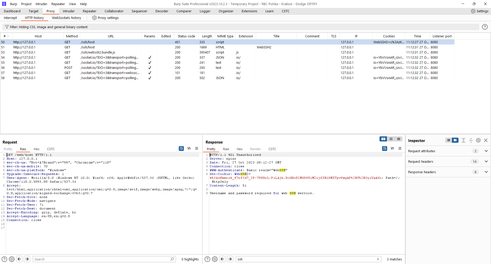
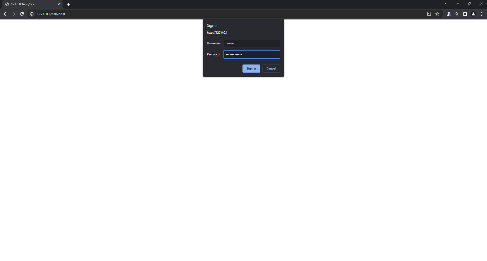
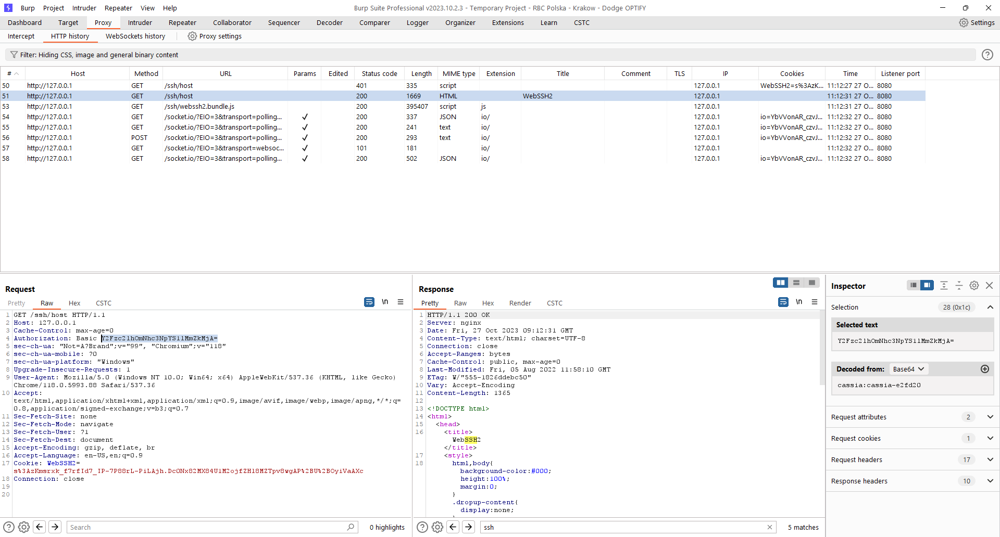
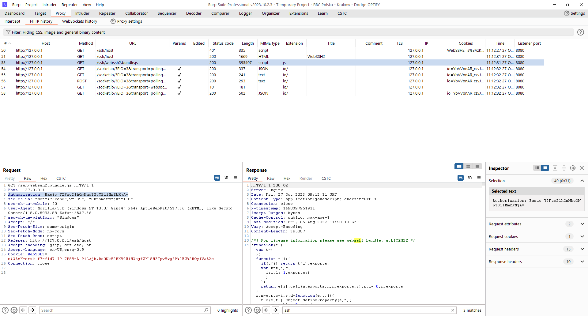
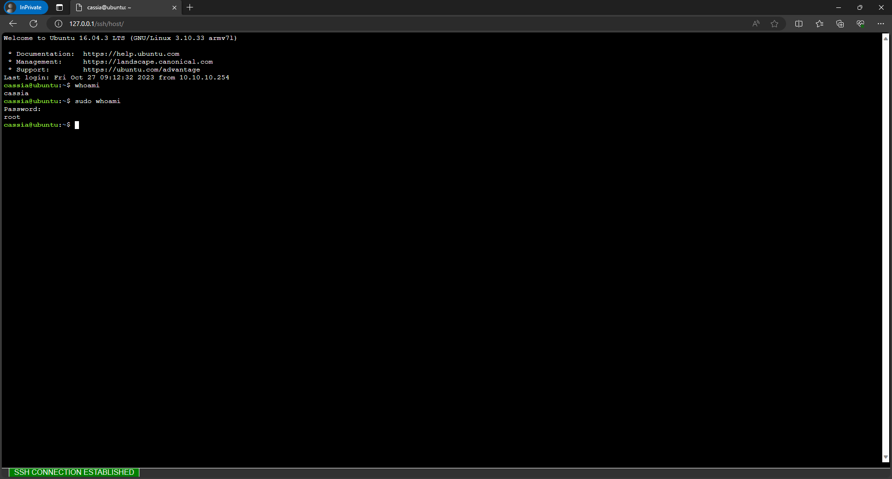

# CVE-2023-35794-WebSSH-Hijacking
Repository contains description for CVE-2023-35794 discovered by Dodge Industrial Team for Dodge OPTIFY platfrom.
___  
CVE ID: CVE-2023-35794  
Vendor: Cassia Networks  
Product: Access Controller  
Version: Cassia-AC-2.1.1.2303271039  
___
Vulnerability: Incorrect Access Control  
Affected: web ssh, gateways  
Decription: WebSSH session can be hijacked  
Status: Confirmed by vendor, Fixed  
Version Patched: Cassia-AC-2.1.1.2308181707
____
#### Details
Cassia uses WebSSH2 by billchurch to initiate SSH sessions from AC to Gateways. WebSSH2 Is a web SSH Client which uses ssh2, socket.io, xterm.js, and express. 
A bare bones example of an HTML5 web-based terminal emulator and SSH client. It uses SSH2 as a client on a host to proxy a Websocket/Socket.io connection to a SSH2 server.

When a session of WebSSH is established with Gateway Device any external user can hijack it without any authentication and authorization.

Session establishment is done via GET request to proper
```/ap/remote/<mac>?ssh_port=<ac-rev-ssh-port>```
Gateway then receiving request through MQTT (or CAPWAP) channel
and establishes SSH tunnel with local port forwarding to Access Controller.
Then Access-Controller binds to the forwarded port with SSH Web Session.
The user who invoked the web ssh session is redirected to
```/ssh/host``` but the session cookie is not validated. 
The new WebSSH2 cookie is provided with 401 error.

In fact a user is being asked for providing Basic auth.

Obtained Basic authentication credentials are sent in next requests
and potentially consumed by webssh2.bundle.js as credentials used to authenticate
to the choosen device.


This allows unathorized to Access Controller portal User to hijack already existing SSH session with only knowing SSH username and password (note that
this commonly may be default ```cassia:cassia-<last-mac-6-digits>```).  

____
#### Exploitation

An attacker may use [CVE-2023-35793](https://github.com/Dodge-MPTC/CVE-2023-35793-CSRF-On-Web-SSH) to trick any athenticated user to initiate
a session to any device connected to the AC (note that the user does not need to login into the gateway, the session itself will be initiated with only exploiting CVE-2023-35793 CSRF). Then using this vulnerability
and knowing the MAC address an attacker may easily obtain access to the device
through WebSSH.

Lets assume an attacker triggered someone and the session is established 
to the gateway where the default credentials are used.

1) Attacker just opens the web browser and enters default credentials for known device.

2) Attacker knowing which device were triggered provides default credentials (commonly these are not being changed)

3) Attacker is authenticated to device LXC container as a user which has root rights by default


#### Remediation
- Patch to the highest possible version availaible on [Cassia Networks](https://www.cassianetworks.com/)